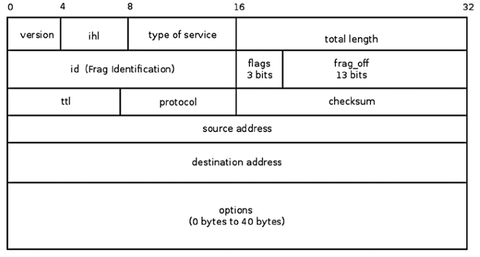

###ipv4 header

 	
 	85 struct iphdr {
 	86 #if defined(__LITTLE_ENDIAN_BITFIELD)
 	 /* 如果是小端，高位存ihl 头长度4Bytes单位，低位存version 版本v4、v6 */
 	87     __u8    ihl:4,   //5<=ihl<=15,ipv4头长度可变，ipv6是固定的
 	88         version:4;   //版本4
 	89 #elif defined (__BIG_ENDIAN_BITFIELD)
 	90     __u8    version:4,
 	91         ihl:4;
 	92 #else
 	93 #error  "Please fix <asm/byteorder.h>"
 	94 #endif
 	95     __u8    tos;           //QoS
 	96     __be16  tot_len;       //总长度 
 	97     __be16  id;            //分片id号
 	98     __be16  frag_off;      //3位分片标志，13位分片偏移量
 	99     __u8    ttl;           //time to live,为0时丢弃，避免无止尽转发
	100     __u8    protocol;     //4层协议  TCP or UDP
	101     __sum16 check;        //校验和
	102     __be32  saddr;        //源ip
	103     __be32  daddr;        //目的ip
	104     /*The options start here. */
	105 };
###ipv4初始化
	ipv4报文在二层头中类型为0x0800;每一个协议需要定义一个处理器，当网络协议栈收到属于该协议的报文时调用。
	初始化代码如下：
	1691 static struct packet_type ip_packet_type __read_mostly = {
	1692     .type = cpu_to_be16(ETH_P_IP),   //定义报文类型 0x0800
	1693     .func = ip_rcv,                  //处理函数
	1694 };
	1696 static int __init inet_init(void)    //boot时初始化
	1697 {
		     ...
	1808     dev_add_pack(&ip_packet_type);
	         ...
	1822 }
###接收ipv4报文
	ipv4接收报文的主要函数是ip_rcv(),该函数主要做合法性检测,实际工作调用ip_rcv_finish()完成，在两者之间有注册的netfilter NF_INET_PRE_ROUTING回调函数调用;在ip_rcv_finish之后会执行路由查找来决定是转发报文还是本地接收，去调用ip_forward()与ip_local_deliver().
	
	
	
	/* linux-3.10.93/net/ipv4/ip_input.c:375 */
	375 int ip_rcv(struct sk_buff *skb, struct net_device *dev, struct packet_type *pt, struct 	net_device *o    rig_dev)
	376 {
	377     const struct iphdr *iph;
	378     u32 len;
	379
	380     /* When the interface is in promisc. mode, drop all the crap
	381      * that it receives, do not try to analyse it.
	382      */
			/* 当网络接口处于混杂模式，会丢弃那些目的地址不是本机的报文，skb->pkt_type在二层调用eth_type_trans()处理时会设置该值，如果报文是单播且mac地址与net_device中不同会设置为PACKET_OTHERHOST */
	383     if (skb->pkt_type == PACKET_OTHERHOST)
	384         goto drop;
	385
	386		//修改snmp计数
	387     IP_UPD_PO_STATS_BH(dev_net(dev), IPSTATS_MIB_IN, skb->len);
	388		//检测是否需要共享skb，当对同类报文有多个处理函数时
	389     if ((skb = skb_share_check(skb, GFP_ATOMIC)) == NULL) {
	390         IP_INC_STATS_BH(dev_net(dev), IPSTATS_MIB_INDISCARDS);
	391         goto out;
	392     }
	393
	394     if (!pskb_may_pull(skb, sizeof(struct iphdr)))
	395         goto inhdr_error;
	396
	397     iph = ip_hdr(skb);
	410     if (iph->ihl < 5 || iph->version != 4)              //检测报文头长度最小20，IPV4版本
	411         goto inhdr_error;
	412
	413     if (!pskb_may_pull(skb, iph->ihl*4))
	414         goto inhdr_error;
	415
	416     iph = ip_hdr(skb);
	417
	418     if (unlikely(ip_fast_csum((u8 *)iph, iph->ihl)))  //检测checksum是否正确，报文头校验和
	419         goto csum_error;
	420
	421     len = ntohs(iph->tot_len);
	422     if (skb->len < len) {
	423         IP_INC_STATS_BH(dev_net(dev), IPSTATS_MIB_INTRUNCATEDPKTS);
	424         goto drop;
	425     } else if (len < (iph->ihl*4))     //skb长度小于报文长度或报文长度小于ipv4头长度显然错误
	426         goto inhdr_error;
			...
			//交给netfilter函数处理，回调函数为ip_rcv_finish
	445     return NF_HOOK(NFPROTO_IPV4, NF_INET_PRE_ROUTING, skb, dev, NULL,
	446                ip_rcv_finish);
			...
	}

	311 static int ip_rcv_finish(struct sk_buff *skb)
	312 {
	313     const struct iphdr *iph = ip_hdr(skb);
	314     struct rtable *rt;
	315 	//sysctl_ip_early_demux 路由缓存使能标志，存储在skb->sk中
			
	316     if (sysctl_ip_early_demux && !skb_dst(skb) && skb->sk == NULL) {
	317         const struct net_protocol *ipprot;
	318         int protocol = iph->protocol;
	319			//获得对应协议的处理函数并调用early_demux
	320         ipprot = rcu_dereference(inet_protos[protocol]);
	321         if (ipprot && ipprot->early_demux) {
	322             ipprot->early_demux(skb);
	323             /* must reload iph, skb->head might have changed */
	324             iph = ip_hdr(skb);
	325         }
	326     }
	327
	328     /*
	329      *  Initialise the virtual path cache for the packet. It describes
	330      *  how the packet travels inside Linux networking.
	331      */
			//路由查找，设置dst_entry input函数地址，可以为ip_forward(),ip_local_deliver(),ip_mr_input()
	332     if (!skb_dst(skb)) {
	333         int err = ip_route_input_noref(skb, iph->daddr, iph->saddr,
	334                            iph->tos, skb->dev);
	335         if (unlikely(err)) {
	336             if (err == -EXDEV)
	337                 NET_INC_STATS_BH(dev_net(skb->dev),
	338                          LINUX_MIB_IPRPFILTER);
	339             goto drop;
	340         }
	341     }
			...
			//调用回调函数，如果为ip_local_deliver()会检测是否分片，然后执行netfilter NF_INET_LOCAL_IN回调函数，最后执行ip_local_deliver_finish()，在该函数中调用对应上层协议的处理函数
	365     return dst_input(skb);