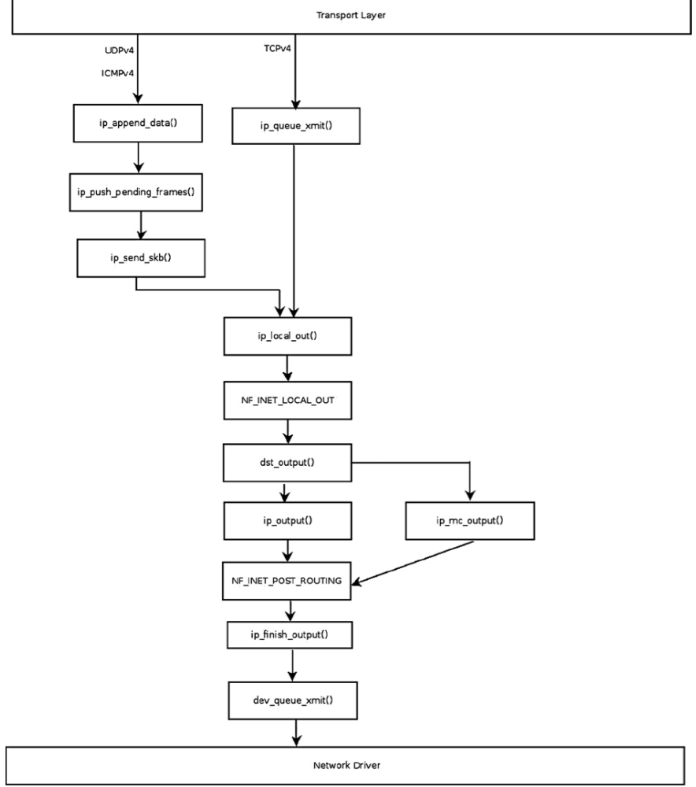

####sending ipv4 packet
从传输层发送报文到网络层主要有两个函数：

* ip_queue_xmit(),当传输层处理分片时使用例如TCPv4；
* ip_append_data(),当传输层自己不处理分片时使用例如UDPv4、ICMPv4;
* raw socket用户层设置IP_HDR	INCL，直接调用dst_output();

流程如下图:

ip_queue_xmit函数:

	326 int ip_queue_xmit(struct sk_buff *skb, struct flowi *fl)
	327 {
 	328     struct sock *sk = skb->sk;
 	329     struct inet_sock *inet = inet_sk(sk);
 	330     struct ip_options_rcu *inet_opt;
 	331     struct flowi4 *fl4;
 	332     struct rtable *rt;
 	333     struct iphdr *iph;
 	334     int res;
 	335
 	336     /* Skip all of this if the packet is already routed,
	337      * f.e. by something like SCTP.
 	338      */
 			//如果路由已存在，则不再执行路由查找
 	339     rcu_read_lock();
 	340     inet_opt = rcu_dereference(inet->inet_opt);
 	341     fl4 = &fl->u.ip4;
 	342     rt = skb_rtable(skb);
 	343     if (rt != NULL)
 	344         goto packet_routed;
 	345
 	346     /* Make sure we can route this packet. */
 			//__sk_dst_check检查路由是否存在，过期等
 	347     rt = (struct rtable *)__sk_dst_check(sk, 0);
 	348     if (rt == NULL) {
 	349         __be32 daddr;	
 	350
	351         /* Use correct destination address if we have options. */
 	352         daddr = inet->inet_daddr;
 	353         if (inet_opt && inet_opt->opt.srr)
 	354             daddr = inet_opt->opt.faddr;
 	355
 	356         /* If this fails, retransmit mechanism of transport layer will
 	357          * keep trying until route appears or the connection times
 	358          * itself out.
 	359          */
 				//路由查找
 	360         rt = ip_route_output_ports(sock_net(sk), fl4, sk,
 	361                        daddr, inet->inet_saddr,
 	362                        inet->inet_dport,
 	363                        inet->inet_sport,
 	364                        sk->sk_protocol,
 	365                        RT_CONN_FLAGS(sk),
 	366                        sk->sk_bound_dev_if);
 	367         if (IS_ERR(rt))
 	368             goto no_route;
 	369         sk_setup_caps(sk, &rt->dst);
 	370     }
 	371     skb_dst_set_noref(skb, &rt->dst);
 	372
 	373 packet_routed:
 	374     if (inet_opt && inet_opt->opt.is_strictroute && rt->rt_uses_gateway)
 	375         goto no_route;
 	376
 	377     /* OK, we know where to send it, allocate and build IP header. */
 			//构建ip报文头
 	378     skb_push(skb, sizeof(struct iphdr) + (inet_opt ? inet_opt->opt.optlen : 0));
 	379     skb_reset_network_header(skb);
	380     iph = ip_hdr(skb);
			//version ipv4, 头长度20bytes
	381     *((__be16 *)iph) = htons((4 << 12) | (5 << 8) | (inet->tos & 0xff));
			//分片标志位
	382     if (ip_dont_fragment(sk, &rt->dst) && !skb->local_df)
	383         iph->frag_off = htons(IP_DF);
	384     else
	385         iph->frag_off = 0;
	386     iph->ttl      = ip_select_ttl(inet, &rt->dst);
	387     iph->protocol = sk->sk_protocol;
	388     ip_copy_addrs(iph, fl4);
	389
	390     /* Transport layer set skb->h.foo itself. */
	391
	392     if (inet_opt && inet_opt->opt.optlen) {
	393         iph->ihl += inet_opt->opt.optlen >> 2;
	394         ip_options_build(skb, &inet_opt->opt, inet->inet_daddr, rt, 0);
	395     }
	396
			// 设置id
	397     ip_select_ident_segs(skb, sk, skb_shinfo(skb)->gso_segs ?: 1);
	398
	399     skb->priority = sk->sk_priority;
	400     skb->mark = sk->sk_mark;
	401
			// 发送报文
	402     res = ip_local_out(skb);
	403     rcu_read_unlock();
	404     return res;
	
	
####ip分片

当报文大小大于MTU时需要分片，ip分片工作由ip_fragment()函数完成

	 //参数output为分片后发送回调函数，当ip_fragment在ip_finish_output()调用时，回调函数为ip_finish_output2()
	 448 int ip_fragment(struct sk_buff *skb, int (*output)(struct sk_buff *))
	 449 {
	 450     struct iphdr *iph;
	 451     int ptr;
	 452     struct net_device *dev;
	 453     struct sk_buff *skb2;
	 454     unsigned int mtu, hlen, left, len, ll_rs;
	 455     int offset;
	 456     __be16 not_last_frag;
	 457     struct rtable *rt = skb_rtable(skb);
	 458     int err = 0;
	 459
	 460     dev = rt->dst.dev;
	 461
	 462     /*
	 463      *  Point into the IP datagram header.
	 464      */
	 465
	 466     iph = ip_hdr(skb);
	 467	 //是否允许分片检查
	 468     if (unlikely(((iph->frag_off & htons(IP_DF)) && !skb->local_df) ||
	 469              (IPCB(skb)->frag_max_size &&
	 470               IPCB(skb)->frag_max_size > dst_mtu(&rt->dst)))) {
	 471         IP_INC_STATS(dev_net(dev), IPSTATS_MIB_FRAGFAILS);
	 472         icmp_send(skb, ICMP_DEST_UNREACH, ICMP_FRAG_NEEDED,
	 473               htonl(ip_skb_dst_mtu(skb)));
	 474         kfree_skb(skb);
	 475         return -EMSGSIZE;
	 476     }
	 ...
	 //frag_list不为NULL，fast path否则slow path
	 497     if (skb_has_frag_list(skb)) {
	 ...     //fast path 条件检查
	 528         err = 0;
	 529         offset = 0;
	 530         frag = skb_shinfo(skb)->frag_list;
	 531         skb_frag_list_init(skb);
	 532         skb->data_len = first_len - skb_headlen(skb);
	 533         skb->len = first_len;
	 			  //首个报文ipv4头
	 534         iph->tot_len = htons(first_len);
	 535         iph->frag_off = htons(IP_MF);
	 			  //重新计算checksum
	 536         ip_send_check(iph);
	 537
	 538         for (;;) {
	 539             /* Prepare header of the next frame,
	 540              * before previous one went down. */
	 541             if (frag) {
	 542                 frag->ip_summed = CHECKSUM_NONE;
	 543                 skb_reset_transport_header(frag);
	 					//使data指向ipv4头,copy iph,设置长度
	 544                 __skb_push(frag, hlen);
	 545                 skb_reset_network_header(frag);
	 546                 memcpy(skb_network_header(frag), iph, hlen);
	 547                 iph = ip_hdr(frag);
	 548                 iph->tot_len = htons(frag->len);
	 					//复制pkt_type, priority, protocol等信息
	 549                 ip_copy_metadata(frag, skb);
	 550                 if (offset == 0)
	 551                     ip_options_fragment(frag);
	 552                 offset += skb->len - hlen;
	 553                 iph->frag_off = htons(offset>>3);
	 554                 if (frag->next != NULL)
	 555                     iph->frag_off |= htons(IP_MF);
	 556                 /* Ready, complete checksum */
	 557                 ip_send_check(iph);
	 558             }
	 559			//发送报文
	 560             err = output(skb);
	 561
	 562             if (!err)
	 563                 IP_INC_STATS(dev_net(dev), IPSTATS_MIB_FRAGCREATES);
	 564             if (err || !frag)
	 565                 break;
	 566
	 567             skb = frag;
	 568             frag = skb->next;
	 569             skb->next = NULL;
	 ...
	 ...  //slow path 需要分配skb，copy内容到新的skb并发送，其他类似
	 